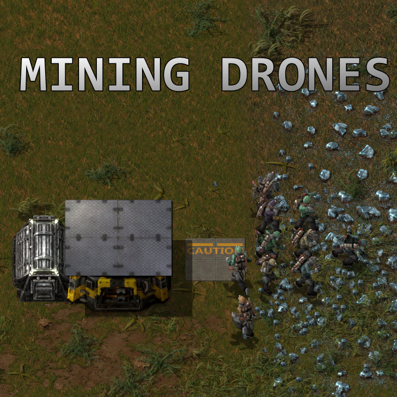

## Transport Drones

(I made a discord if anybody is interested in discussing my mods [Invite link](https://discordapp.com/invite/ktg8h7t) )

--------------------------------------

Adds a new 'Transport system' to the game.
Graphics by bubbles from the Factorio discord.

Mod tutorial by Nilaus: https://youtu.be/FaQMThNH43g

There is 1 technology to unlock the transport system (road, depots, drones):

Drones start with a speed of 22km/h, and a stack capacity of 1.
There are 2 upgrade technologies, Transport drone speed and Transport drone stack capacity.

